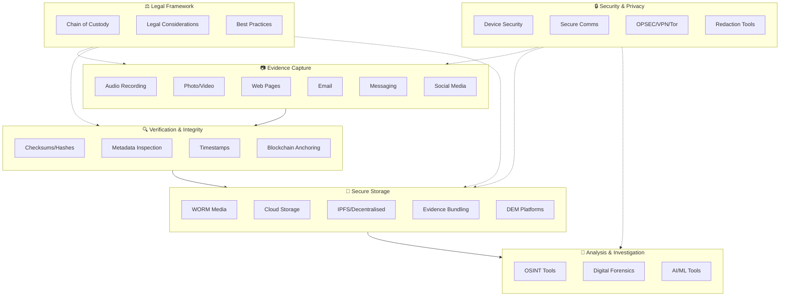

# Digital Evidence Toolkit

A curated collection of freely available tools and guides to assist individuals in gathering, preserving, and authenticating digital evidence.

**Last Updated:** January 28, 2025

**Disclaimer:** This repository is for informational purposes only and does not constitute legal advice. Adapt these methods to your own needs and consult legal counsel regarding evidence admissibility in your jurisdiction.

> **AI Disclosure:** This documentation was developed with the assistance of [Claude Code](https://claude.ai/code), an AI coding assistant by Anthropic. All content has been reviewed for accuracy, but users should verify information independently for their specific use cases.

> **Note on Tool Listings:** The tools documented here represent a curated selection, not an exhaustive catalogue. Many categories (cloud storage, blockchain timestamping, metadata tools, etc.) have numerous additional providers and alternatives beyond those listed. We focus on well-established, accessible options to illustrate workflows rather than provide comprehensive market coverage.

---

## How It All Connects

The diagram below shows how different components of digital evidence management work together:

---

## Quick Reference Index

| Category | Description | Key Tools |
|----------|-------------|-----------|
| [Guides](#important-reading) | Foundation documents | Chain of custody, legal, best practices |
| [Evidence Capture](#evidence-capture) | Recording & collection | ProofMode, ASR, SingleFile, eEvid |
| [Evidence Storage](#evidence-storage) | Preservation & integrity | S3 Object Lock, OpenTimestamps, BagIt |
| [Verification](#metadata-inspection) | Integrity & authenticity | ExifTool, MediaInfo, checksums |
| [Investigations](#investigations) | OSINT & forensics | Maltego, Hunchly, Timesketch |
| [Redaction](#redaction--anonymisation) | Privacy & PII removal | Video/audio/document redaction |
| [OPSEC](#operational-security-opsec) | Investigator protection | VPNs, Tor, secure comms |
| [Apps](#apps-by-platform) | Platform-specific | Android, iOS, desktop |

---

## Important Reading

Start here to understand the foundational concepts:

- [Chain of Custody](guides/chain-of-custody.md) - Understanding evidence integrity and the capture-to-storage workflow
- [Legal Considerations](guides/legal-considerations.md) - Consent laws and legal requirements before capturing evidence
- [Best Practices](guides/best-practices.md) - Suggested workflows for evidence management

---

## Evidence Capture

Tools and methods for capturing different types of digital evidence.

### [Audio](evidence-capture/audio/)
- [ASR (Android Smart Recorder)](evidence-capture/audio/asr-android.md) - Android audio capture app
- [Sony ICD Series](evidence-capture/audio/sony-icd-series.md) - Physical digital voice recorders
- [PR200 Bluetooth Recorder](evidence-capture/audio/pr200-bluetooth.md) - Discrete Bluetooth recording device

### [Email](evidence-capture/email/)
- [eEvid](evidence-capture/email/eevid.md) - Certified email delivery with proof

### [Photo & Video](evidence-capture/photo-video/)
- [Content Authenticity Initiative](evidence-capture/photo-video/content-authenticity.md) - Hardware-level image certification (Leica, Pixel, etc.)

### [Web Pages](evidence-capture/web-pages/)
- [Browser Extensions](evidence-capture/web-pages/browser-extensions.md) - SingleFile and other extensions for saving web pages

### [Messaging](evidence-capture/messaging/)
Extracting and preserving chat/messaging evidence.

### [Social Media](evidence-capture/social-media/)
Preserving posts, profiles, and social media content.

---

## Evidence Storage

Secure storage and preservation methods.

### [WORM Media](evidence-storage/worm-media/) - Write Once, Read Many
- [AWS S3 Object Lock](evidence-storage/worm-media/aws-s3-object-lock.md) - Cloud-based immutable storage
- [Physical WORM Media](evidence-storage/worm-media/physical-worm.md) - Optical discs, tape

### [Timestamps & Blockchain](evidence-storage/timestamps/)
- [OpenTimestamps](evidence-storage/timestamps/opentimestamps.md) - Blockchain-anchored timestamps
- [Blockchain-Based Evidence](evidence-storage/blockchain/README.md) - Timestamping, notarisation, and immutable records

### [Decentralised Storage](evidence-storage/ipfs.md)
- [IPFS](evidence-storage/ipfs.md) - Content-addressed peer-to-peer storage with built-in integrity verification

### [Checksums](evidence-storage/checksums/)
- [Checksum Utilities](evidence-storage/checksums/overview.md) - File integrity verification

### [Cloud Storage](evidence-storage/cloud-storage/)
- [Tresorit](evidence-storage/cloud-storage/tresorit.md) - End-to-end encrypted cloud storage
- [Prodatix](evidence-storage/cloud-storage/prodatix.md) - Immutable cloud storage with retention
- [Rclone](evidence-storage/cloud-storage/rclone.md) - Sync tool for 70+ cloud providers (with GUI option)

> **Note:** Many cloud providers offer immutable storage options (Azure Blob Immutable Storage, Google Cloud Storage retention policies, Backblaze B2, Wasabi, etc.). The tools listed above are representative examples.

### [Specialist Hardware](evidence-storage/hardware/)
- [Object First Ootbi](evidence-storage/hardware/objectfirst-ootbi.md) - Immutable backup appliance

### [Evidence Bundling](evidence-storage/bundling/)
- [BagIt & Packaging Tools](evidence-storage/bundling/README.md) - Tools for packaging evidence with integrity verification

### [Digital Evidence Management](evidence-storage/dem-solutions.md)
- Enterprise DEM platforms (Axon Evidence, FileOnQ) - Note: Many are law enforcement only

---

## Metadata Inspection

Tools for examining file metadata and detecting manipulation.

- [ExifTool](infosec/metadata-inspection/exiftool.md) - Industry-standard metadata reader/writer
- [MediaInfo](infosec/metadata-inspection/mediainfo.md) - Video/audio technical metadata
- [Additional Tools](infosec/metadata-inspection/additional-tools.md) - Metadata Extractor, Diffusion Toolkit, Dataset Tools (including AI image metadata)

---

## Redaction & Anonymisation

Tools for removing PII and anonymising evidence before sharing.

- [Overview](infosec/redaction/overview.md) - Principles and best practices
- [Image Redaction](infosec/redaction/image-redaction.md) - Photo/image anonymisation tools
- [Video Redaction](infosec/redaction/video-redaction.md) - Video anonymisation and face blurring
- [Document Redaction](infosec/redaction/document-redaction.md) - PDF and document redaction
- [Audio Redaction](infosec/redaction/audio-redaction.md) - Audio censoring and anonymisation
- [PII Detection Tools](infosec/redaction/pii-tools.md) - Automated PII scanning and masking
- [Anonymisation Tools](infosec/redaction/anonymisation-tools.md) - Database and dataset anonymisation

---

## Investigations

OSINT and data gathering tools for research and investigations.

- [Maltego](investigations/maltego.md) - Link analysis and OSINT platform
- [Hunchly](investigations/hunchly.md) - Web capture tool for investigations

### [Digital Forensics](investigations/forensics/)
- [Forensics Tools & Guides](investigations/forensics/README.md) - Timesketch, Kuiper, and forensic artifact resources

---

## Operational Security (OPSEC)

Protecting yourself during evidence gathering and investigations.

- [Operational Security Guide](opsec/operational-security.md) - OPSEC principles and checklist
- [VPNs](opsec/vpns.md) - Privacy-focused VPN recommendations
- [Tor Browser](opsec/tor.md) - Anonymous browsing for sensitive research

---

## Information Security (InfoSec)

Securing your devices and communications.

- [Device Security](infosec/device-security.md) - Securing devices that handle evidence
- [Secure Communications](infosec/secure-communications.md) - Encrypted messaging and file sharing

---

## AI Tools

AI and machine learning tools for evidence-related tasks.

- [AI Tools Overview](ai-tools/README.md) - LLM tools and considerations for evidence work

---

## Apps by Platform

Quick reference for apps organized by operating system.

| Platform | Apps Available |
|----------|---------------|
| [Android](apps/android/) | ProofMode, Capture Cam, ASR, FolderSync Pro |
| [iOS](apps/ios/) | Capture Cam (limited options) |
| [Windows](apps/windows/) | Desktop tools |
| [macOS](apps/macos/) | Desktop tools |
| [Linux](apps/linux/) | Desktop tools |

---

## Related Projects

Other repositories that may assist with evidence handling:

- [Proofmode-Unpacker](https://github.com/danielrosehill/Proofmode-Unpacker) - Tool for processing and extracting ProofMode evidence exports
- [Claude-Evidence-Assistant](https://github.com/danielrosehill/Claude-Evidence-Assistant) - AI-assisted evidence analysis and documentation
- [WhatsApp-Export-Unpacker](https://github.com/danielrosehill/WhatsApp-Export-Unpacker) - Extract and organize WhatsApp chat exports

---

## Contributing

Contributions welcome. Please submit issues or pull requests for:
- New tools or resources
- Corrections or updates
- Platform-specific guides
- Regional legal considerations
