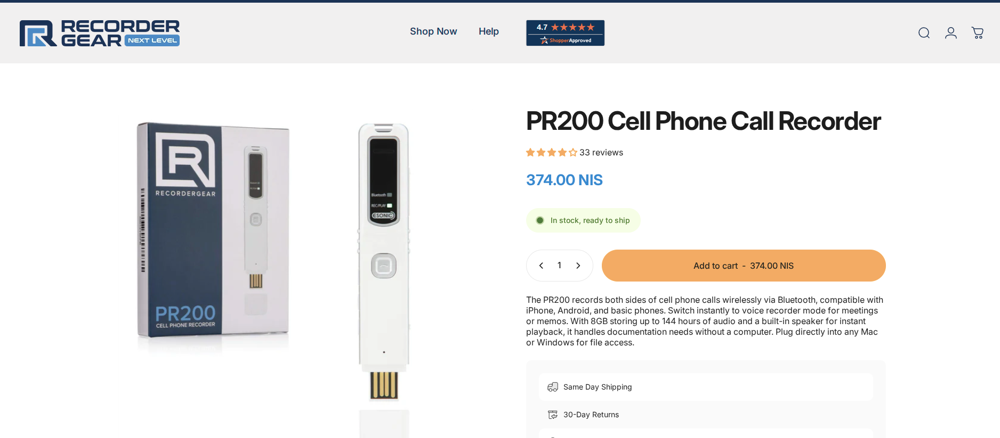

# PR200 Bluetooth Recorder

**Platform:** Dedicated Hardware
**Type:** Bluetooth Recording Device
**Cost:** ~$30-50

## Overview

The PR200 is a compact Bluetooth voice recorder that pairs with smartphones for discrete audio capture.

## Key Features

- Bluetooth connectivity to smartphone
- Compact, wearable form factor
- Can be concealed or worn as accessory
- Records to internal storage
- Battery-powered

## Use Cases

- Discrete recording in one-party consent jurisdictions
- Backup recording device
- Situations where phone recording is impractical

## Legal Considerations

**Read [Legal Considerations](../../guides/legal-considerations.md) before use.**

This type of device is designed for discrete recording. Usage legality depends entirely on your jurisdiction:

- **One-party consent jurisdictions:** Generally permissible if you are a participant
- **Two-party consent jurisdictions:** May be illegal without all-party consent

Misuse of covert recording devices can result in civil or criminal liability.

## Technical Notes

- Pair with phone via Bluetooth settings
- Check battery before recording sessions
- Transfer files for backup after recording
- Audio quality varies; test before relying on it

## Related Tools

- [Sony ICD Series](sony-icd-series.md) - Higher quality dedicated recorder
- [ASR Android](asr-android.md) - Phone-based recording
