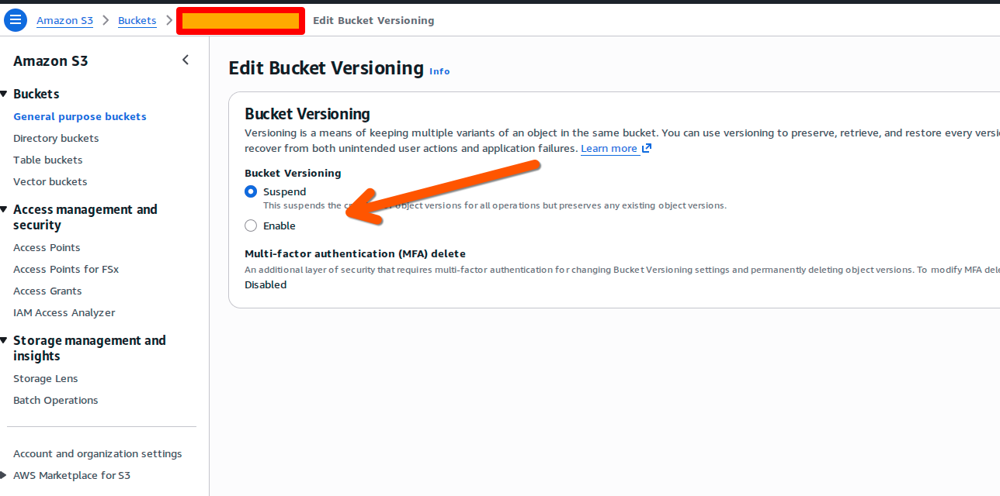
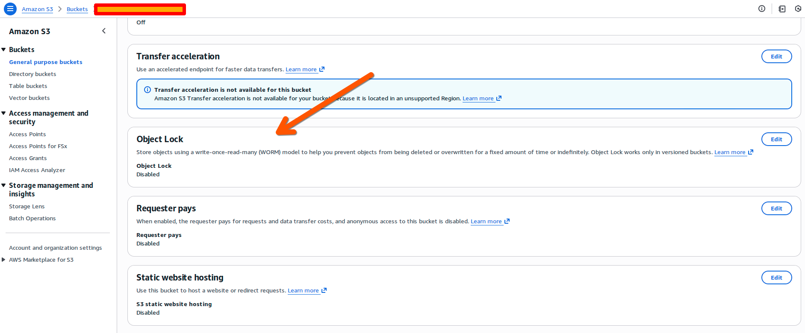
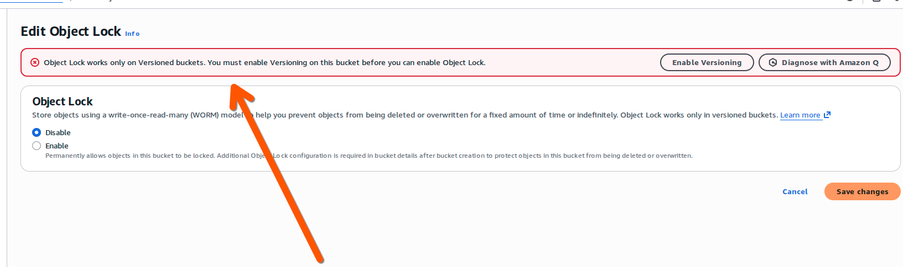

# AWS S3 Object Lock

**Platform:** Cloud
**Type:** WORM Storage Service
**Cost:** Pay-per-use (S3 pricing + Object Lock)

## Overview

AWS S3 Object Lock provides Write Once, Read Many (WORM) storage by preventing objects from being deleted or overwritten for a specified retention period.

## Key Features

- Immutable object storage
- Configurable retention periods
- Compliance mode (no one can delete, including root)
- Governance mode (privileged users can override)
- Legal hold capability
- Versioning support

## Setup

1. Create an S3 bucket with Object Lock enabled (must be set at bucket creation)
2. Configure default retention settings or apply per-object
3. Choose retention mode:
   - **Governance:** Allows override with special permissions
   - **Compliance:** No override possible until retention expires

### Enabling Bucket Versioning

Object Lock requires versioning to be enabled on the bucket.

### Finding Object Lock Settings

Navigate to the bucket properties to find the Object Lock section.

### Enabling Object Lock

Note: Versioning must be enabled before Object Lock can be activated.

## Use for Evidence Storage

Object Lock is suitable for storing original evidence archives:

- Upload ProofMode ZIP archives
- Set retention period appropriate to your needs
- Use Compliance mode for strongest protection
- Enable versioning for additional safety

## Considerations

- Object Lock must be enabled when bucket is created
- Compliance mode cannot be shortened or removed
- Storage costs continue during retention period
- Consider lifecycle policies for long-term cost management

## Alternatives

- **Wasabi Object Lock** - S3-compatible, often cheaper
- **Backblaze B2** - Object Lock available
- **Azure Immutable Blob Storage** - Microsoft equivalent
- [Physical WORM Media](physical-worm.md) - Offline option

## References

- [AWS S3 Object Lock Documentation](https://docs.aws.amazon.com/AmazonS3/latest/userguide/object-lock.html)
